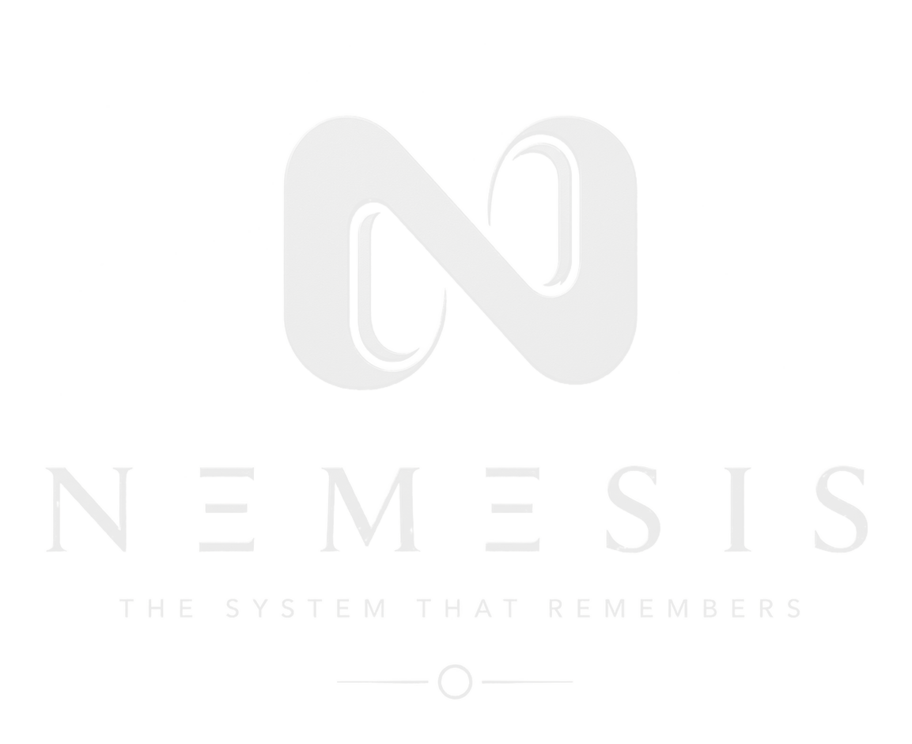

<div align="center">



<br>

### **Networked Enforcement & Municipal Evidence System for Infrastructure & Service Accountability**

<sub>─────────────────────────────  ○  ─────────────────────────────</sub>

<br>

[](https://github.com/pranavpanchal1326/Nemesis)
[](#-architecture)
[](#-tech-stack)
[](#-tech-stack)
[](#-tech-stack)
[](#-license)

</div>

<br>

---

## 🏛️ The Manifesto

> ### **NEMESIS**
> *The AI Civic Operations Agent*

There's a particular kind of silence that settles over a neighborhood after people stop believing anything will change. A pothole gets reported. The app says *"In Progress."* Weeks pass. The pothole is still there — or worse, patched so poorly it reopens by monsoon. No one knows who did the work, what it cost, or why it failed. So the next complaint never gets filed. 

That silence isn't apathy. **It's the sound of a system that broke its promise once too often.**

<br>

<div align="center">

| **NEMESIS exists to make that promise unbreakable.** |
|:---:|

</div>

<br>

At its heart, **NEMESIS** takes the raw, chaotic texture of civic life — a blurry photo of a broken streetlight, a voice note in Marathi about a gas smell, a hurried GPS pin dropped from a phone — and turns it into something a city can actually act on: a **verified, deduplicated, severity-scored work order**, routed to the right department, in seconds.

But turning a complaint into a ticket is the easy part. Every civic app before this one has managed that much and then quietly died at the same point — the moment status flips to *"Resolved"* and nobody checks if that's true. **NEMESIS is built backward from that exact failure.** It doesn't just log the fix. It **proves it** — with before-and-after photos verified by structural-similarity analysis, a citizen confirmation loop that closes the story instead of assuming it, and an append-only, hash-chained record that makes every claim in the system checkable rather than just trusted.

And it goes one layer deeper than any complaint-routing tool has dared to go: **it follows the money.** Every fix is tied to a contractor, a cost, a funding source, a public record. Vendors build a real, computed reputation — SLA adherence, cost variance, repeat-defect rate — not a single collapsed star rating that hides the truth. Patterns that would otherwise stay invisible — the same "different" contractors sharing an address, the same pothole "fixed" three times in eight months — surface as evidence, not accusation, always with a fair dispute channel on the other side.

Underneath it all sits a quiet discipline the team calls **The Nemesis Standard**: *no claim without an evidence trail.* It shows up everywhere:
- In a **safety fail-safe** that's deliberately hardcoded rather than left to a model's judgment, because a false negative on *"gas leak"* is unacceptable;
- In a **severity score** that shows its arithmetic instead of hiding behind a black box;
- In an **equity layer** that actively hunts for the neighborhoods too disconnected to complain, rather than mistaking their silence for the absence of a problem.

It runs **entirely offline**, on open-source models, at **near-zero cost** — not as a limitation, but as a statement: *this is infrastructure a city can trust with its data, not a vendor it becomes dependent on.*

<br>

> [!IMPORTANT]
> **The Line That Captures It All:**
> *"A citizen's photo becomes a verified, deduplicated, severity-scored work order in seconds — and unlike everything that came before it, NEMESIS doesn't just log the complaint. It proves it got fixed, and it makes the money and the people who spent it fully visible."*

<br>

<div align="center">
<sub><i>Where other tools ask citizens to trust the system, NEMESIS gives them a reason to.</i></sub>
</div>

<br>

<sub>─────────────────────────────  ○  ─────────────────────────────</sub>

<br>

## 📌 Contents

<div align="center">

`01` [The Nemesis Standard](#-the-nemesis-standard) &nbsp;·&nbsp; 
`02` [Core Philosophy](#-core-philosophy) &nbsp;·&nbsp; 
`03` [Architecture](#-architecture) &nbsp;·&nbsp; 
`04` [Tech Stack](#-tech-stack) &nbsp;·&nbsp; 
`05` [Complaint Lifecycle](#-complaint-lifecycle)

`06` [Deduplication Engine](#-deduplication-engine) &nbsp;·&nbsp; 
`07` [Severity Rubric](#-severity-rubric) &nbsp;·&nbsp; 
`08` [Contractor Accountability](#-contractor-accountability) &nbsp;·&nbsp; 
`09` [Trust & Safety](#-trust--safety)

`10` [What's Real, Right Now](#-whats-real-right-now) &nbsp;·&nbsp; 
`11` [Quickstart](#-quickstart) &nbsp;·&nbsp; 
`12` [API Surface](#-api-surface) &nbsp;·&nbsp; 
`13` [Roadmap](#-roadmap) &nbsp;·&nbsp; 
`14` [License](#-license)

</div>

<br>

---

## ⚖️ The Nemesis Standard

In Greek myth, **Nemesis** is retribution against those who believe themselves beyond consequence. That is the exact failure this system targets — infrastructure spending that evades consequence because nothing closes the loop between *"money was spent"* and *"the problem was actually fixed."*

Internally, one sentence governs every design decision in this repository:

<div align="center">

### **<code>No claim without an evidence trail.</code>**

</div>

Externally, the product never reads as punitive. It's procedural, evidence-based, and fair to every party it touches — contractors included, with a real dispute channel of their own. The name carries the mission; the interface carries none of the edge.

<br>

---

## 🧠 Core Philosophy

Three commitments shape every line of this codebase:

| Principle | Technical Realization |
|:---|:---|
| **Deterministic Where It Matters** | Safety triggers are hardcoded rules, not model probability scores. A false negative on *"gas leak"* or *"live power line"* is not an acceptable trade for AI elegance. |
| **Append-Only, Always** | Nothing is silently edited or erased. Corrections are new cryptographic events layered on top of history — including corrections made by a super-admin. |
| **Honest About What's Built** | Nothing in this documentation is described more strongly than what actually runs. See [§10](#-whats-real-right-now) for the explicit build matrix. |

<br>

---

## 🏗️ Architecture

NEMESIS is an **event-driven, immutable audit system**, not a standard CRUD application. A complaint is a sequence of cryptographically hash-chained events moving through a state machine — driven by deterministic rules with a single agentic component reserved for ambiguous edge cases.

```
                            ┌──────────────────────────┐
                            │      Citizen Web App     │
                            │  Browser-First · Offline │
                            │        Capable UI        │
                            └──────────────┬───────────┘
                                           │  HTTPS / WebSockets
                                           ▼
                            ┌──────────────────────────┐
                            │      FastAPI Gateway     │
                            │ Ingest · Auth · Routing │
                            │      WebSocket Hub       │
                            └──────────────┬───────────┘
                                           │
                    ┌──────────────────────┼──────────────────────┐
                    ▼                      ▼                      ▼
            ┌───────────────┐    ┌────────────────┐    ┌────────────────┐
            │     Redis     │    │ Celery Workers │    │     Ollama     │
            │ Queue · PubSub│    │ Async Pipeline │    │ Qwen2.5 / Llama│
            │ Rate Limiting │    │     Stages     │    │ Local & Offline│
            └───────────────┘    └────────┬───────┘    └────────┬───────┘
                                           │                      │
                                           ▼                      ▼
                            ┌──────────────────────────────────────────┐
                            │          NEMESIS Core Pipeline           │
                            │  Intake → Safety → Classify → Dedup →    │
                            │  Severity Scoring → Department Route     │
                            │  (Investigation Agent triggered only on  │
                            │   ambiguous deduplication boundaries)    │
                            └──────────────────┬───────────────────────┘
                                               ▼
                            ┌──────────────────────────────────────────┐
                            │                PostgreSQL                │
                            │  + PostGIS   — Geospatial Clustering     │
                            │  + pgvector  — HNSW Vector Embeddings    │
                            │  + events    — Hash-Chained Event Store  │
                            └──────────────────┬───────────────────────┘
                                               ▼
                            ┌──────────────────────────────────────────┐
                            │     Neo4j — Contractor Fraud Graph       │
                            │   Surfaces shared directors, addresses,  │
                            │   & phones across distinct vendor entities│
                            └──────────────────────────────────────────┘
                                               │
                    ┌──────────────────────────┼──────────────────────┐
                    ▼                          ▼                      ▼
           ┌────────────────┐        ┌────────────────┐     ┌────────────────┐
           │   Public UI    │        │ Department UI  │     │    Admin UI    │
           │  Map · Spend   │        │  Role-Scoped   │     │ Full Audit Log │
           │  Vendor Stats  │        │  Kanban Board  │     │ Cross-Ward View│
           └────────────────┘        └────────────────┘     └────────────────┘
```

> [!NOTE]
> - **Why unified Postgres over microservices?** `pgvector` with HNSW indexing matches dedicated vector databases for under a million vectors — yielding a single backup strategy, one connection pool, and zero multi-service sync failures.
> - **Why one agent, not four?** Three pipeline stages (Intake, Classification, Ops) are deterministic pipelines (schema validation, CLIP forward pass, SLA timers). The **Investigation Agent** is the sole component that dynamically plans tool execution steps based on evidence, preserving architectural clarity.

<br>

---

## 💻 Tech Stack

<table>
<tr><td valign="top" width="50%">

### 🎨 Frontend & Experience
- **Framework**: Next.js 15 (App Router) + TypeScript
- **Styling**: Vanilla CSS + Tailwind CSS + `shadcn/ui`
- **Mapping**: Leaflet.js + OpenStreetMap *(Zero API keys, zero rate-limit surprises)*
- **Visualization**: React Three Fiber + Drei *(3D cluster-merge animation)*
- **State**: Zustand *(WebSocket events → reactive state)*
- **Motion**: Framer Motion *(Micro-interactions & visual transitions)*

### ⚡ Backend Engine
- **API Server**: FastAPI (Async) + Pydantic v2
- **Task Queue**: Celery + Redis *(Distributed async pipelines)*
- **Realtime**: WebSockets *(Live execution event streaming)*
- **Authentication**: FastAPI-Users + JWT *(Role-scoped RBAC)*

</td><td valign="top" width="50%">

### 🗄️ Persistence & Graph
- **Database**: PostgreSQL 16 + PostGIS + `pgvector`
- **Event Store**: Immutable `events` table with SHA-256 hash-chaining
- **Graph Database**: Neo4j *(Contractor entity-resolution & fraud graph)*

### 🤖 Local AI & Vision *(Zero API Cost)*
- **Zero-Shot Vision**: OpenAI CLIP *(Unified category classification)*
- **Audio Transcription**: `faster-whisper` *(Hindi & Marathi voice intake)*
- **Text Embeddings**: `sentence-transformers` (`all-MiniLM-L6-v2`)
- **Reasoning LLM**: Ollama (`Qwen2.5` / `Llama 3.1`)
- **Agent Orchestration**: LangGraph
- **Verification Engine**: `scikit-image` SSIM *(Structural Similarity for photos)*

</td></tr>
</table>

<br>

---

## 🔄 Complaint Lifecycle

```
 1. SUBMIT              Photo · Voice · Text · GPS from Citizen UI
       │
 2. VERIFY              EXIF/GPS cross-match · Perceptual Hash · Safety Scan · Velocity Check
       │                      │
       │                      └── 🚨 DANGER SIGNAL ──▶ Bypass queues → Human alert within minutes
       ▼
 3. CLASSIFY             CLIP Zero-Shot classification across all categories, logged as Event
       ▼
 4. DEDUPLICATE          PostGIS Radius Filter ──▶ pgvector Cosine Similarity
       │                      │
       │                      └── 🔍 AMBIGUOUS BAND ──▶ Investigation Agent evaluates evidence
       ▼
 5. SCORE SEVERITY        Transparent weighted rubric, component breakdown persisted
       ▼
 6. ROUTE                 Tenant department routing config, SLA countdown initiated
       ▼
 7. EXECUTE               Staff / Contractor assignment · Milestone photo proof
       ▼
 8. VERIFY CLOSURE        SSIM Structural Similarity analysis on Before vs. After photos
       ▼
 9. CITIZEN CONFIRMS       "Was this actually fixed?" ──▶ Confirmed / Disputed / Auto-Closed
       ▼
10. PUBLIC RECORD         Contractor Profile updated · Ward Budget ledger synced
```

<br>

---

## ⚡ Deduplication Engine — The Core Moat

Duplicate complaints ruin municipal workflow queues. NEMESIS employs a two-stage deduplication pipeline that executes in milliseconds:

### Stage 1 — Geospatial Bounding Box (PostGIS)
Eliminates ~90% of non-candidate issues before running heavy embedding distance calculations:

```sql
SELECT id, category, location, reported_at
FROM complaints
WHERE ST_DWithin(location, ST_MakePoint(:longitude, :latitude)::geography, 50) -- 50-meter radius
  AND reported_at > NOW() - INTERVAL '72 hours'
  AND status NOT IN ('resolved', 'closed');
```

### Stage 2 — Multi-Modal Embedding Cosine Distance (`pgvector`)
Calculates visual and textual similarity on the candidates surviving Stage 1:

```sql
SELECT id,
       1 - (image_embedding <=> :new_image_embedding) AS visual_sim,
       1 - (text_embedding  <=> :new_text_embedding)  AS text_sim
FROM complaints
WHERE id = ANY(:stage1_candidate_ids)
ORDER BY GREATEST(visual_sim, text_sim) DESC;
```

- **$\ge 0.85$ Similarity**: Automatically merged into a confidence-weighted cluster.
- **$0.65 - 0.85$ Similarity**: Routed to the **Investigation Agent** for visual context evaluation.
- **$< 0.65$ Similarity**: Treated as a distinct, novel complaint.

<br>

---

## 📊 Severity Rubric

Rather than relying on an opaque neural network output, NEMESIS calculates severity via a **transparent, auditable formula**:

$$\text{Severity} = 0.40 \cdot \mathcal{S}_{\text{damage}} + 0.25 \cdot \mathcal{W}_{\text{road}} + 0.20 \cdot \mathcal{S}_{\text{poi}} + 0.15 \cdot \mathcal{C}_{\text{reports}}$$

```
  0.40 × Visual Damage Score    (CLIP confidence × damage-type weight)
+ 0.25 × Road Priority Weight   (OSM Highway tag: primary > residential > footway)
+ 0.20 × POI Proximity Score    (Proximity decay within 200m of schools/hospitals)
+ 0.15 × Cluster Density        (Number of independent citizen reports merged)
```

Every sub-score is stored in the audit log alongside the complaint, ensuring total transparency.

<br>

---

## 🤝 Contractor Accountability & Fraud Graph

NEMESIS turns municipal procurement into an evidence-based system:

- 📈 **Public Vendor Profiles**: Tracks real SLA compliance %, citizen verification rate %, cost variance, and repeat-defect frequency.
- 🕸️ **Neo4j Fraud Graph**: Detects collusion by linking vendor entities sharing physical addresses, corporate directors, or contact numbers across nominally distinct bidding entities.
- 💰 **Milestone Disbursements**: Funds are unlocked in tranches (30% start, 40% mid-progress, 30% citizen-verified completion) backed by SSIM photo proof.
- ⚖️ **Fairness First**: Includes seasonal SLA normalization (monsoon weather adjustments) and formal contractor dispute workflows.

<br>

---

## 🛡️ Trust & Safety Matrix

| Threat / Risk | Safeguard & Mitigation |
|:---|:---|
| **Spoofed Image Location** | EXIF metadata verification with fallback to mandatory live camera capture. |
| **Re-uploaded / Stock Photos** | Perceptual hashing (`pHash`) detects duplicate image uploads across accounts. |
| **Spam / Brigading** | Device fingerprinting + submission velocity limits trigger human moderation. |
| **Critical Hazards (Gas Leak, Wires)** | **Hardcoded keyword & visual bypass** routes hazard alerts immediately to dispatch. |
| **Audit Log Tampering** | Event store is SHA-256 hash-chained; past events cannot be modified or deleted. |
| **Bystander Privacy** | Automated face & license plate blurring executed locally prior to storage. |

<br>

---

## ✅ What's Real, Right Now

We believe in radical engineering honesty. Here is the exact status of every system component:

| Component | Status | Implementation Details |
|:---|:---:|:---|
| **Two-Stage Deduplication (PostGIS + pgvector)** |  | Built & functional in SQL pipeline |
| **Transparent Severity Rubric** |  | Formula logged per complaint |
| **Hazard Deterministic Bypass** |  | Hardcoded rule engine active |
| **Hash-Chained Event Store** |  | SHA-256 event chaining on write |
| **CLIP Zero-Shot Categorization** |  | Self-hosted model pipeline |
| **Investigation Agent** |  | Multi-step reasoning via Ollama |
| **Before/After SSIM Photo Verification** |  | `scikit-image` comparison active |
| **3D Cluster-Merge Visualization** |  | React Three Fiber shader with DOM fallback |
| **Contractor Neo4j Fraud Graph** |  | Schema designed, queries mocked |
| **Milestone Disbursement Engine** |  | Real data model with simulated payout |

<br>

---

## 🚀 Quickstart

Run the complete NEMESIS stack locally in seconds with **Docker**:

```bash
# 1. Clone the repository
git clone https://github.com/pranavpanchal1326/Nemesis.git
cd Nemesis

# 2. Build and launch all containers (FastAPI, Redis, Postgres, Ollama)
docker compose up --build

# 3. Seed demo dataset (synthetic complaints & contractor entities)
docker compose exec api python scripts/seed_demo_data.py
```

Access the interfaces locally:
- 🌐 **Citizen Portal**: `http://localhost:3000`
- 🏢 **Department Kanban**: `http://localhost:3000/department`
- 🛡️ **Admin & Audit Console**: `http://localhost:3000/admin`

<br>

---

## 📡 API Surface

### 1. Ingest Complaint
```http
POST /api/v1/complaints
Content-Type: multipart/form-data

photo: [binary]
audio: [binary]
description_text: "Gas leak smell near main road"
latitude: 18.5204
longitude: 73.8567
device_fingerprint: "fp_98a72f1"
```

```json
{
  "complaint_id": "c7b8a910-12d3-4e5f-a678-90abcdef1234",
  "status": "submitted",
  "estimated_processing_time_seconds": 4
}
```

### 2. Retrieve Complaint Status & Severity Breakdown
```http
GET /api/v1/complaints/c7b8a910-12d3-4e5f-a678-90abcdef1234
```

```json
{
  "status": "clustered",
  "category": "pothole",
  "classification_confidence": 0.94,
  "severity_score": 0.78,
  "severity_breakdown": {
    "visual_damage_score": 0.85,
    "road_class_weight": 0.70,
    "poi_proximity_score": 0.60,
    "cluster_report_count": 0.50
  }
}
```

<br>

---

## 🗺️ Roadmap

```
Phase 1 (Days 1–30)  : Core Hardening ──▶ Background hash-chain verification sweep & Postgres RLS
Phase 2 (Days 31–60) : Tenant Pilot   ──▶ Live contractor dispute workflow & milestone payouts
Phase 3 (Days 61–90) : Graph Analytics──▶ Live Neo4j entity-resolution fraud engine
```

<br>

---

## 📄 License

Distributed under the **MIT License**. See [`LICENSE`](./LICENSE) for details.

<br>

<div align="center">


<br>

### **NEMESIS**
<sub>**THE SYSTEM THAT REMEMBERS**</sub>

*Every claim, checked before it's said out loud to a citizen, a contractor, or a judge.*

</div>