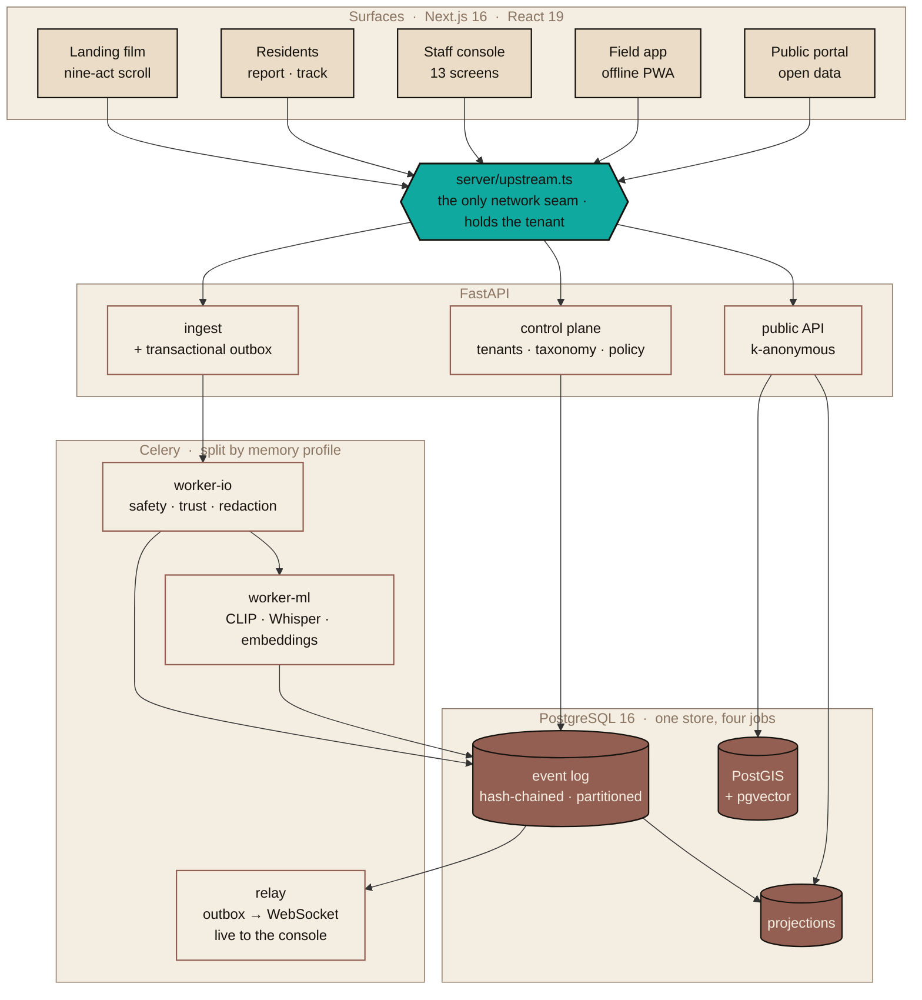

<div align="center">


<h1>NEMESIS</h1>

**Networked Enforcement & Municipal Evidence System**<br>
<sub>for Infrastructure & Service Accountability</sub>

<sub>─────────────────  ○  ─────────────────</sub>

### *The system that remembers*

<br>


</div>

<br>

> There's a particular kind of silence that settles over a neighbourhood after people stop believing anything will change. A pothole gets reported. The app says *"In Progress."* Weeks pass. The pothole is still there — or worse, patched so poorly it reopens by monsoon. No one knows who did the work, what it cost, or why it failed. So the next complaint never gets filed.
>
> **That silence isn't apathy. It's the sound of a system that broke its promise once too often.**

NEMESIS is a municipal accountability platform built on one premise: **a civic system earns trust by producing evidence, not status updates.** Every figure it publishes is computed from an append-only event log. Every claim it makes about *itself* carries a status label. Nothing is edited by hand.

<div align="center"><sub>─────────────────  ○  ─────────────────</sub></div>

<br>

## The product

<div align="center">


<br>

<sub><b>The Walk</b> — a nine-act scroll film over a 3D clay model of the city. Every place the model draws is listed beside it in text, at full contrast, for anyone the canvas fails.</sub>

</div>

<br>

<div align="center">

| <br><sub><b>For residents</b> — report it, follow it, read what the city publishes.</sub> | <br><sub><b>For staff</b> — thirteen console screens, each carrying its own honesty chip.</sub> |
|:---:|:---:|

</div>

<br>

<div align="center">


<br>

<sub><b>The receipts</b> — the last act is deliberately boring. A live <code>curl</code>, the honesty counts, and every place this deployment publishes.</sub>

</div>

<br>

<div align="center"><sub>─────────────────  ○  ─────────────────</sub></div>

## How a report moves

A citizen submits. The request is accepted synchronously and handed to an event-sourced pipeline — every stage **appends events** rather than mutating rows, so the log is the truth and every table is a projection of it.

```mermaid
flowchart LR
    A([Citizen<br/>submits]) --> B[ingest]
    B --> C[safety<br/>check]
    C --> D[trust<br/>verification]
    D --> E[classification]
    E --> F[dedup]
    F --> G[severity<br/>scoring]
    G --> H[routing<br/>· SLA]
    H --> I[investigation<br/>agent]
    I --> J([Public<br/>figures])

    classDef live fill:#EADCC7,stroke:#16130F,stroke-width:2px,color:#16130F
    classDef soon fill:#F4EDE1,stroke:#8A7462,stroke-width:1px,stroke-dasharray:4 3,color:#8A7462
    classDef edge fill:#925F52,stroke:#16130F,stroke-width:2px,color:#F4EDE1
    class B,C,D,E,F live
    class G,H,I soon
    class A,J edge
```



<sub>**Solid** = shipped and gated. **Dashed** = Phase 12 / 16, not built. The product says so on every screen that would otherwise show an empty number.</sub>

Three properties are load-bearing:

- **The safety fail-safe runs on its own queue**, served by a container that has never imported `torch`. A saturated ML queue cannot delay a gas-leak report. A trigger halts the pipeline outright.
- **Degradation is recorded, not swallowed.** Every external call has a timeout, a retry budget, a fallback, and a `pipeline_stage_degraded` event. `DEGRADED` is deliberately a different outcome from `FAILED` — correct degradation must not inflate the ratio that pages a human.
- **Deduplication is reversible.** A merge is undone by a compensating event, never by a delete.

<div align="center"><sub>─────────────────  ○  ─────────────────</sub></div>

## Architecture



**One trust boundary, held on the server.** No browser ever names its own tenant — every read goes through a single seam that owns the typed client, the tenant header, and the middleware that turns a transport failure into a designed answer instead of a framework crash page.

**One Postgres.** Relational, geospatial (PostGIS), vector (pgvector), and the event log all live in one database, because a distributed transaction across four stores is a consistency bug waiting for a deadline.

<div align="center"><sub>─────────────────  ○  ─────────────────</sub></div>

## The stack

<table>
<tr><th align="left" width="16%">Layer</th><th align="left">Chosen</th><th align="left" width="42%">Why this one</th></tr>

<tr><td><b>API</b></td>
<td>FastAPI · Pydantic v2 · SQLAlchemy 2 (async) · asyncpg</td>
<td>Typed request/response all the way to the OpenAPI document the frontend generates against.</td></tr>

<tr><td><b>Data</b></td>
<td>PostgreSQL 16 · PostGIS · pgvector · Alembic</td>
<td>One store for four jobs. The event log is range-partitioned by month from the first migration.</td></tr>

<tr><td><b>Async</b></td>
<td>Celery · Redis · transactional outbox</td>
<td>Workers split <b>by memory profile</b>, not by domain — the ML container's footprint must never gate a safety check.</td></tr>

<tr><td><b>Perception</b></td>
<td>OpenCLIP · faster-whisper · sentence-transformers (multilingual-e5)</td>
<td>CPU-only inference against tenant-authored prompt sets. A new category is config, not a retrain.</td></tr>

<tr><td><b>Frontend</b></td>
<td>Next.js 16 · React 19 · TypeScript</td>
<td>Server components by default. The public doors work with JavaScript disabled.</td></tr>

<tr><td><b>3D</b></td>
<td>Three.js · React Three Fiber · drei · three-mesh-bvh · WebGPU</td>
<td>A generated clay city. Not a modelled asset — a kit assembled from real ground measurements in metres.</td></tr>

<tr><td><b>Maps</b></td>
<td>MapLibre GL · deck.gl</td>
<td>The 2D rung of a four-tier capability ladder that degrades to a printed storyboard.</td></tr>

<tr><td><b>Motion</b></td>
<td>Theatre.js · GSAP · Lenis</td>
<td>The film's camera is <b>authored as keys and generated</b> into a Theatre project, never hand-tweened.</td></tr>

<tr><td><b>State</b></td>
<td>Zustand · TanStack Query · openapi-fetch</td>
<td>The API client is generated from the live document. A contract drift is a compile error.</td></tr>

<tr><td><b>Observability</b></td>
<td>OpenTelemetry · Prometheus · Tempo · Grafana · Alertmanager</td>
<td>Opt-in compose profile. 28 runbooks — one per failure scenario, not one per service.</td></tr>

<tr><td><b>Gates</b></td>
<td>pytest · Vitest · Playwright · axe-core · Lighthouse CI · ruff · mypy --strict</td>
<td>Plus ten bespoke design guards and four Python standards checkers.</td></tr>
</table>

<div align="center"><sub>─────────────────  ○  ─────────────────</sub></div>

## The design system

This is the part most civic software skips. NEMESIS is built as **a printing press**, and that is a technical decision with teeth, not a mood board.

**Three materials, and nothing else exists.**

<table>
<tr>
<td align="center" width="33%"><b>CLAY</b><br><sub>the world</sub><br><br>The city is a generated model at real ground scale. A pin's height is severity — never decoration.</td>
<td align="center" width="33%"><b>INK</b><br><sub>people</sub><br><br>Four drawn figures, animated as a state machine on a 12 fps clock. No file format, no rigging.</td>
<td align="center" width="33%"><b>PAPER</b><br><sub>documents</sub><br><br>Everything a citizen can hold: receipts, ward pages, the honesty table.</td>
</tr>
</table>

<sub>A photograph would be a fourth material, so there are none. A stock image of a pothole that is not <i>this city's</i> pothole is a picture of evidence on the page where a resident is about to file some. Every illustration in this repository is drawn in the run's own inks.</sub>

**One press runs over all three.** Six stages — separation, halftone screen, misregistration, ink density, overprint, paper — implemented twice from one token source: a WebGPU shader for the 3D world, an SVG filter for the 2D surfaces.

**Two or three inks per run**, the real risograph constraint. Colour is never decorative: severity glazes are the only colours in the product that carry meaning.

<div align="center">


<sub>severity — the only meaningful colour</sub><br>


</div>

**Every one of those values is generated.** `design/tokens.json` compiles to CSS custom properties and TypeScript, and a CI guard fails the build on a hand-written colour literal anywhere in application source. The severity ink in a badge and the glaze in a shader are the same number because both are written in one place.

<div align="center"><sub>─────────────────  ○  ─────────────────</sub></div>

## Quick start

```bash
nem doctor
```

```bash
nem up
```

Builds and starts the stack, blocking until every service is healthy. Then the frontend:

```bash
nem web
```

An empty deployment renders **honestly** — every ward reads *"not yet scored"* and *"none filed"*. To get a city with a week behind it:

```bash
nem seed-demo --reports 140
```

<sub><code>--reports</code> defaults to <code>0</code>, which is the commonest reason a fresh checkout looks broken. Everything the seeder creates goes over HTTP through the real handlers — no fixture loader, no <code>INSERT</code>. Reports get classified, clustered, redacted and scored by the same pipeline a real one goes through, which is why some come out flagged.</sub>

<details>
<summary><b>Every task <code>nem</code> knows</b></summary>

<br>

| | |
|---|---|
| `nem up` · `down` · `nuke` | Stack lifecycle (`nuke` destroys volumes) |
| `nem check` · `web-check` | Every quality gate CI runs, backend and frontend |
| `nem seed-demo` | Provision the demo city |
| `nem migrate` · `makemigration` · `rollback` | Alembic |
| `nem web-types` · `web-openapi` | Regenerate the typed client from the live document |
| `nem obs` · `obs-verify` | Observability stack, and prove metric → alert end to end |
| `nem gate-phase3…10` | Per-phase exit gates |
| `nem flag` · `control-plane` | Feature flags and tenant admin |
| `nem web-golden` · `web-lighthouse` | Visual regression and performance budgets |

</details>

<div align="center"><sub>─────────────────  ○  ─────────────────</sub></div>

## Repository

```
├── backend/            FastAPI · Celery · SQLAlchemy      179 modules · ~48k lines
│   └── nemesis/
│       ├── events/         append-only log, 34 registered types, hash-chained
│       ├── pipeline/       the stages, each one appending rather than mutating
│       ├── projections/    the ONLY module allowed to write current-state tables
│       ├── control_plane/  tenants · taxonomy · zones · calendars · locales
│       ├── policy/         rubrics and rules as versioned, effective-dated documents
│       ├── perception/     CLIP · Whisper · embeddings, with a model registry
│       └── public/         k-anonymous aggregates and open-data export
│
├── frontend/           Next.js 16 · React 19              215 modules · ~38k lines
│   └── src/
│       ├── design/         tokens.json → generated CSS + TS. The source of truth.
│       ├── press/          §E6 in two implementations, one token source
│       ├── clay/           the generated 3D city and its accessible peer list
│       ├── ink/            four drawn figures as a state machine
│       ├── story/          the nine-act landing film
│       ├── console/        thirteen operator screens
│       ├── citizen/        capture · track · the pipeline theatre
│       └── portal/         the two front doors
│
├── docs/
│   ├── adr/            61 architecture decision records
│   ├── runbooks/       28 — one per failure scenario
│   └── reports/        measured results, including the ones that failed
│
├── infra/              compose profiles, Grafana dashboards, alert rules
└── scripts/            standards checkers and phase gates
```

<div align="center"><sub>─────────────────  ○  ─────────────────</sub></div>

## The rules that are actually enforced

Not style preferences. Every one fails a build.

| | Rule |
|---|---|
| **1** | **State changes and events land in one transaction.** No row mutates without an event explaining it. One module writes projections; an AST walk enforces it. |
| **2** | **Event schemas are immutable once locked.** A fingerprint file covers every payload. Changing a released schema fails CI — register `v2` with an upcaster. |
| **3** | **Every query is tenant-scoped, visibly.** A checker reads the AST at each `select()`. A tenant predicate hidden behind a variable is one it cannot see, and it fails you. |
| **4** | **Configuration over code.** Anything a customer might want different is tenant data. A hardcoded category, role, ward or language tag fails the build. |
| **5** | **Deterministic ≠ hardcoded.** The safety fail-safe is a hot-reloadable governed ruleset that still executes as a hard rule: document order, first match wins, no regex. |
| **6** | **Every external call degrades on the record**, with `DEGRADED` kept distinct from `FAILED`. |
| **7** | **Prove, don't log.** Every phase has a machine-checkable exit gate. A skipped gate is technical debt with a false receipt. |
| **8** | **The honest number ships either way.** One phase published four categories below its own F1 floor. Another published a failing gate. |
| **9** | **Every non-obvious decision gets an ADR.** All 61 of them. |
| **10** | **No colour, duration, curve or type size is written by hand.** Ten design guards enforce it across the frontend. |

<div align="center"><sub>─────────────────  ○  ─────────────────</sub></div>

## Where this actually is

The product publishes its own answer to this question at `/{tenant}/honesty` and in Act 9 of the landing — generated from the same source, so it cannot drift into a flattering summary. **Trust those over this table.**

Thirty phases across nine tracks. Roughly a third are built and gated.

| Track | Phases | State |
|---|---|---|
| **0 · Operating system** | 0, 1a | ✅ gated · 1b deferred until a deploy target exists |
| **A · Platform** | 2, 3, 4 | ✅ event store, ingestion, public API |
| **B · Control plane** | 5, 6, 7 | ✅ tenants, policy engine, backtesting |
| **C · Intelligence** | 8, 9, 10 | ✅ safety, perception, dedup · 11–12 not started |
| **D · Accountability** | 13–17 | ❌ identity, work orders, closure, agent, contractor transparency |
| **E · Experience** | 18–22 | 🟡 design system, 3D engine, film, console and doors built ahead of schedule |
| **F–I · Data, trust, commercial, release** | 23–29 | ❌ not started |

**One open blocker worth naming.** Public ward figures are computed by matching complaints to zones. Routing — the stage that writes that label — is Phase 12 and does not exist, so the join falls back to the geometry the tenant already published, using the report's own coordinate. It is correct, indexed, and **retires itself** the day routing lands. Full detail in [`docs/CONNECTING-A-BACKEND.md`](docs/CONNECTING-A-BACKEND.md).

<div align="center"><sub>─────────────────  ○  ─────────────────</sub></div>

## Documentation

| | |
|---|---|
| [**HANDOVER.md**](docs/HANDOVER.md) | Where the system is, the rules that govern it, what is owed. **The entry point for backend work.** |
| [**CONNECTING-A-BACKEND.md**](docs/CONNECTING-A-BACKEND.md) | The four env variables, the one network seam, and the open blocker above. |
| [**PHASES.md**](docs/PHASES.md) | All thirty phases, their tracks, owners and dependencies. |
| [**BACKLOG.md**](docs/BACKLOG.md) | What remains, broken into startable items. |
| [**adr/**](docs/adr/) | 61 decision records. Read `0061` for how a run gets its exposure. |
| [**runbooks/**](docs/runbooks/) | 28 failure scenarios, each with a diagnosis path. |
| [**NEMESIS-Blueprint-v2.md**](NEMESIS-Blueprint-v2.md) | The product specification the phases implement. |
| [**NEMESIS-Frontend-Blueprint.md**](NEMESIS-Frontend-Blueprint.md) | §E — the design direction, materials and press. |

<br>

<div align="center">

<sub>─────────────────  ○  ─────────────────</sub>


**A civic system earns trust by producing evidence.**

<sub>Every figure on every page is computed from reports filed by residents.<br>Nothing is edited by hand.</sub>

</div>
